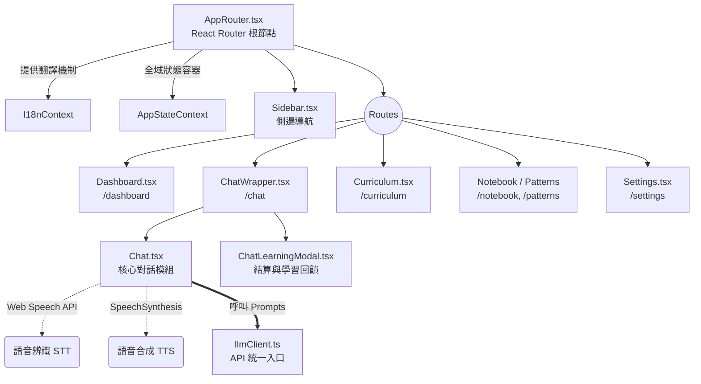
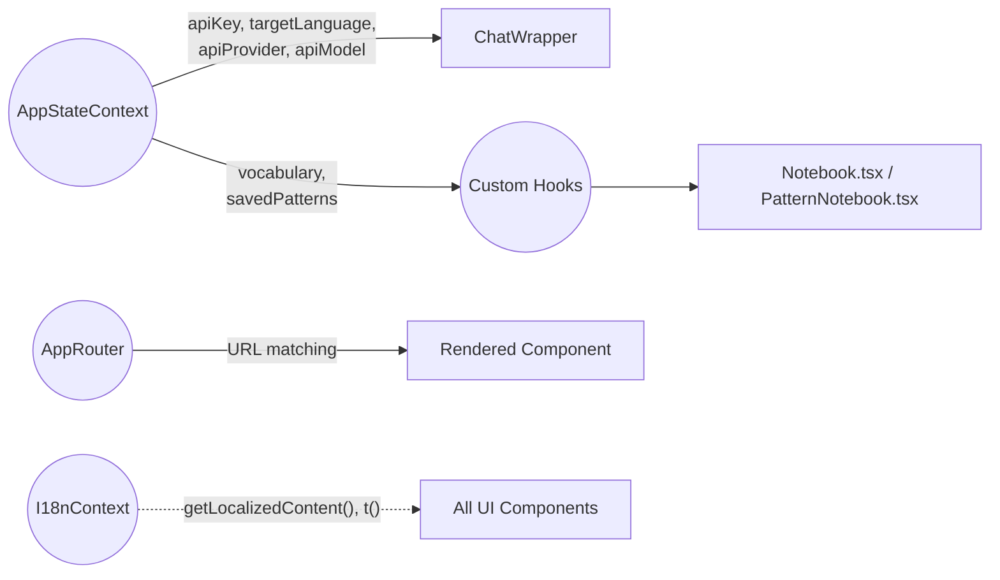

# Multi-Lang Coach 系統分析書 (SA Document)

本文件旨在提供 Multi-Lang Coach 專案的全面架構與邏輯解析，讓未來的開發團隊、維護人員，乃至於 AI Agent 都能依據此文件精準重建或擴充相同功能的系統。

> [!NOTE]
> ## 0. 系統分析書編撰規範 (SA Document Meta-Guidelines)
> *本前導說明專為未來的 AI 協作者設計，定義維護或擴充這份 `系統分析書.md` 時必須遵循的格式與風格。*
>
> ### [Tone & Formatting Style]
> - **Language**: 繁體中文為主，技術專有名詞保留英文原名（如 State, Component, Payload）。
> - **Tone**: 專業、簡潔、結構化，避免冗長無意義的敘述語氣。
> - **Modularity**: 若未來擴充的清單或原始碼過長，必須使用 `<details>` 與 `<summary>` HTML 標籤進行摺疊。
>
> ### [Structural Requirements]
> - **Visuals**: 必須使用 Mermaid (`mermaid` 區塊) 來繪製元件關聯圖與資料流拓樸，嚴禁僅使用純文字描述複雜架構。
> - **Schema Definitions**: 所有的資料模型（如 `localStorage`、API Request/Response 格式）一律使用 TypeScript `interface` 語法呈現，以確保 AI 解析時型別嚴謹。
> - **Alerts**: 對於專案中的特例、Bug Workaround 或絕對不可更改的限制，一律使用 GitHub Flavored Markdown Alerts (`[!CAUTION]`, `[!WARNING]`, `[!IMPORTANT]`) 標註。
>
> ### [AI Agent Directive Protocol]
> - 本文件第 8 章的「AI 代理重構指令碼」為**最高優先級的機器讀取區塊**。任何針對專案架構、狀態流或是防呆約束的修改，都**必須同步更新**該指令碼章節。

---

## 1. 專案概述 (Project Overview)

- **專案背景與目標**：Multi-Lang Coach 是一款由大型語言模型 (LLM) 驅動的互動式語言學習平台。解決傳統語言學習缺乏「真實情境演練」與「即時專業糾錯」的痛點。
- **目標受眾**：希望在職場 (如 IT、HR、行銷) 或日常生活情境中，精進英語或日語口說與對話流暢度、準確度的使用者。
- **核心功能亮點**：
  - 支援多 LLM 服務商 (Google Gemini API, Groq) 的高擬真情境對話。
  - 系統化課程 (Curriculum) 零基礎特訓功能。
  - 即時語音辨識 (支援跨平台 Web Speech API 與 Android 專屬處理機制)。
  - 即時文法糾錯與單字/片語萃取。
  - 多語系 (I18n) 介面與主題風格 (Theme) 切換功能。
  - 單字本 (Notebook) 與句型庫 (Pattern Notebook) 的個人化整理。

---

## 2. 系統架構與技術選型 (System Architecture & Tech Stack)

- **前端框架**：React 18 + Vite + **TypeScript** (全面強型別化)。純前端架構，無後端伺服器。
- **路由機制**：使用 **React Router (`react-router-dom`)** 實作真實的 SPA 路由 (定義於 `AppRouter.tsx`)，支援 URL 深層連結與瀏覽器歷史紀錄，並透過 `RouteTracker` 自動記憶最後訪問頁面。
- **狀態管理**：
  - 全域狀態集中於 `src/contexts/AppStateContext.tsx`，使用 React Context API + Hooks。
  - I18n 多國語言狀態集中於 `src/contexts/I18nContext.tsx`。
  - 持久化透過 `localStorage` (搭配 IndexedDB 遷移機制 `idbStorage.ts`) 進行。
- **UI/UX 樣式**：Vanilla CSS (`App.css`, `index.css`)，全面採用 CSS Variables 實作深色主題、淺色主題與玻璃擬物化 (Glassmorphism) 設計切換。
- **第三方整合**：Google Gemini API、Groq API、Web Speech API、`html2pdf.js`。

### 視覺化系統架構


---

## 3. 功能模組與元件規劃 (Module Specifications)

專案組件集中於 `src/components`，並進行了高度的模組化拆分：

### 3.1 AppRouter.tsx & AppStateContext.tsx (核心容器與全域狀態)
- **`AppRouter.tsx`**：應用的 Entry Point，包裝了 `<BrowserRouter>`, `<I18nProvider>` 與 `<AppStateProvider>`，並負責攔截初次載入時的路由跳轉 (`InitialRedirect`) 以及顯示迎新彈窗 (`WelcomeModal`)。
- **`AppStateContext.tsx`**：集中管理所有的使用者設定（API Key, 目標語言, 語速, 介面主題）、學習紀錄（單字本, 句型庫）以及進度（Streak），並且負責綁定 `localStorage` 進行雙向同步。

### 3.2 對話引擎生態系 (Chat Engine)
- **`ChatWrapper.tsx`**：對話引擎的外層容器，負責管理對話紀錄 (`chatHistory`) 與呼叫結算彈窗。
- **`Chat.tsx`**：專注處理與 LLM 的即時對話呈現、語音輸入邏輯、TTS 朗讀。
  > [!NOTE]
  > 支援「混合模式語音輸入」：電腦端預設使用原生 Web Speech API。Android 端則啟動特殊機制（詳見第 9 章邊界條件），改採音檔錄製轉 Base64 後交由 AI 或其他服務解析。
- **`ChatLearningModal.tsx`**：當對話任務結束時彈出，顯示 AI 從對話中萃取的精華單字與句型，讓使用者勾選並存入單字本。
- **`ChatExportModal.tsx`**：負責將對話紀錄匯出為 PDF 等格式的介面。

### 3.3 其他輔助模組
<details>
<summary>點擊展開模組詳情</summary>

- **`Sidebar.tsx`**：提供側邊導航列與介面風格切換。
- **`Dashboard.tsx`**：顯示學習進度，並從 `scenariosData.ts` 動態讀取當日對話任務。
- **`Curriculum.tsx`**：系統化課程模組，引導使用者從零基礎學習單字與句型。
- **`Notebook.tsx` & `PatternNotebook.tsx`**：管理從對話中擷取的單字或使用者手動加入的句型。支援 TTS 朗讀。
- **`Patterns.tsx`**：展示靜態的基礎/進階句型，提供「句型代換練習 (Pattern Drill)」入口。
- **`components/pages/`**：包含 AboutUs, PrivacyPolicy, ContactUs 等靜態頁面。
- **`Footer.tsx`**：顯示版權聲明與靜態頁面連結。
- **`GlassSelect.tsx`**：共用的玻璃風格下拉式選單組件。
</details>

---

## 4. 資料模型與狀態管理 (Data Models)

應用程式依賴 `AppStateContext` 與 `localStorage` 進行狀態管理。我們使用 TypeScript Interface 來嚴謹定義核心資料模型：

### 4.1 Chat History Schema (對話紀錄模型)
```typescript
interface ChatMessage {
  role: 'system' | 'user' | 'assistant';
  content: string;               // 訊息內文
  translation?: string;          // 目標語言的 UI 翻譯
  correction?: {                 // 文法糾錯 (若無錯誤則為 null)
    original: string;
    error: string;
    fixed: string;
    explanations: Record<string, string>; // 多語系解說
  };
  extractedVocab?: Array<{       // 從對話中擷取的新單字
    term: string;
    phonetic: string;
    partOfSpeech: string;
    meaning: string;
    example: string;
  }>;
}
```

### 4.2 LocalStorage 鍵值映射 (Keys)
所有狀態鍵值與初始邏輯已封裝於 `AppStateContext.tsx`。
```typescript
interface LocalStorageKeys {
  APP_API_PROVIDER: string;           // 選擇的 API 提供者 (gemini / groq)
  APP_API_MODEL: string;              // 自訂模型名稱 (例如 llama-3.1-8b-instant)
  APP_GEMINI_API_KEY: string;         // API 憑證
  APP_USER_CAT: string;               // 使用者分類 (如: business)
  APP_USER_ROLE: string;              // 角色 (如: it)
  APP_USER_LEVEL: string;             // 程度 (如: pre-intermediate)
  IT_APP_TARGET_LANG: 'en' | 'ja';    // 學習目標語言
  APP_SPEECH_RATE: string;            // TTS 語速設定
  APP_AUTO_READ: string;              // 是否自動朗讀回覆
  APP_UI_THEME: string;               // 介面風格 (glass, saas-dark, saas-light)
  APP_ACTIVE_TAB: string;             // 當前處於的頁籤 (供 React Router 攔截記憶)
  APP_HAS_SEEN_WELCOME: string;       // 是否看過迎新教學
}
```

---

## 5. 提示詞工程與 AI 引擎 (Prompt Engineering & LLM)

底層統一呼叫 `src/utils/llmClient.ts`。與舊版架構不同，所有的 **System Prompts 已被徹底抽離至獨立模組**，集中管理於 `src/prompts/` 資料夾下，確保指令與 API 呼叫邏輯解耦。

- **`src/prompts/` 目錄結構**：
  - `chat.ts`: 定義情境對話的角色扮演與回應限制。
  - `analyze.ts`: 負責指導模型分析句子，輸出單字、句型與文法結構的 JSON 格式。
  - `polish.ts`: 負責指導模型潤飾或翻譯使用者的不完美語句。
  - `conversation.ts`: 負責對話結算時的學習回饋（詞彙與句型提取）指令。
  - `types.ts`: 定義提示詞所需的 TypeScript 參數型別。

`llmClient.ts` 負責路由至指定的提供商（Gemini / Groq）並解析回傳的 JSON 結構。

---

## 6. 多語系與靜態資料庫設計 (I18n & Static Data)

資料結構分為兩大類：TypeScript 結構定義檔與 JSON 多語系翻譯檔。

- **`src/locales/`**：存放介面 (UI) 的純文字翻譯檔（例如 `en.json`, `zh-TW.json`, `ja.json`）。
- **`src/data/` (TypeScript 設定)**：
  - `categoryData.ts`：定義可選的 Categories、Roles 與 Levels。
  - `scenariosData.ts`：提供 `getScenariosByRole` 函數，依據角色動態生成情境任務。
  - `curriculumData.ts`：定義課程系統的單元 (Unit)、核心單字。
- **大數據句型庫 (JSON)**：
  - **`src/data/patterns/`**：按目標語言與情境分類存放的靜態句型。
  - **`src/data/scenarioPatterns/`**：按目標語言存放的情境專用海量句型庫。
  - *特性*：所有句型 JSON 都必須包含 `translations` 與 `explanations` 物件，內含 `zh-TW`, `en`, `ja`, `ko`, `es`, `fr` 六國語言對照。前端由 `I18nContext.tsx` 中的 `getLocalizedContent` 自動攔截並根據 `uiLang` 動態渲染。

---

## 7. 未來擴展與維護指南 (Maintenance)

- **新增情境或角色**：修改 `categoryData.ts` 新增 Role ID，並於 `scenariosData.ts` 加入情境邏輯。
- **擴充多語系句型庫**：可直接透過外部 AI 批量翻譯 `src/data/scenarioPatterns/` 中的 JSON 檔案，補齊 `translations` 的各語言欄位，前端 `getLocalizedContent` 會自動生效。
- **微調 AI 指令**：直接修改 `src/prompts/*.ts` 中的字串，無需更動 `llmClient.ts` 邏輯。
- **新增頁面**：於 `src/components/` 建立組件後，至 `AppRouter.tsx` 的 `<Routes>` 中註冊新路徑，並於 `Sidebar.tsx` 加入導覽列。

---

## 8. AI 代理重構指令碼 (AI Agent Reconstruction Directive)

*This section is strictly formatted for LLM/AI Agent parsing. Do NOT modify unless updating core architecture constraints.*

### [Repository Skeleton]
```text
/src
 ├─ main.tsx (React Root)
 ├─ AppRouter.tsx (React Router & Entry Point)
 ├─ App.css & index.css (CSS variables & multi-theme classes)
 ├─ /components (Sidebar, Dashboard, Curriculum, Notebook, PatternNotebook, Patterns, Settings, Guide)
 │   ├─ ChatWrapper.tsx (Chat layout & state container)
 │   ├─ Chat.tsx (LLM dialogue & Voice UI)
 │   ├─ ChatLearningModal.tsx (Post-chat feedback)
 │   └─ /pages (AboutUs, PrivacyPolicy, ContactUs)
 ├─ /contexts (AppStateContext.tsx, I18nContext.tsx)
 ├─ /hooks (useVocabulary.ts, usePatterns.ts, useProgress.ts)
 ├─ /prompts (chat.ts, analyze.ts, polish.ts, types.ts - Centralized Prompts)
 ├─ /utils (llmClient.ts, pdfExporter.ts, idbStorage.ts)
 ├─ /locales (zh-TW.json, en.json... UI Translations)
 └─ /data
     ├─ categoryData.ts, scenariosData.ts, curriculumData.ts
     ├─ /patterns (Multi-lang JSON dictionaries)
     └─ /scenarioPatterns (Multi-lang JSON dictionaries)
```

### [State Flow Topology]

All states are centrally managed in `AppStateContext.tsx` and automatically synced to `localStorage`. `AppRouter.tsx` handles purely UI routing.

### [Core Logic Constraints (CRITICAL)]

> [!CAUTION]
> **1. LLM JSON Fallback (CRITICAL)**: Inside `llmClient.ts`, when parsing LLM responses for JSON, you MUST implement a fallback regex to strip ` ```json ` and ` ``` ` tags. LLMs frequently wrap JSON in markdown blocks despite explicit system instructions.

> [!WARNING]
> **2. Android STT Bug Workaround**: Android Chrome Web Speech API duplicates text continuously. Inside `Chat.tsx` `toggleRecording`, you MUST check if `androidSmartSpeech` is enabled. If true, bypass native SpeechRecognition and utilize alternative MediaRecorder logic for STT.

> [!IMPORTANT]
> **3. TTS Multi-Lang Segmentation**: In `Chat.tsx` `handleSpeak`, English sentences containing translated text MUST be split by regex into separate `SpeechSynthesisUtterance` instances. Do not rely on the browser to auto-switch languages mid-sentence.

> [!IMPORTANT]
> **4. Data Localization Protocol**: All dynamic pattern rendering (e.g., inside `Patterns.tsx` or `Curriculum.tsx`) MUST use `getLocalizedContent(p.translations)` instead of the UI translation wrapper `t()`. The UI `t()` is strictly reserved for static strings found in `src/locales/`.
