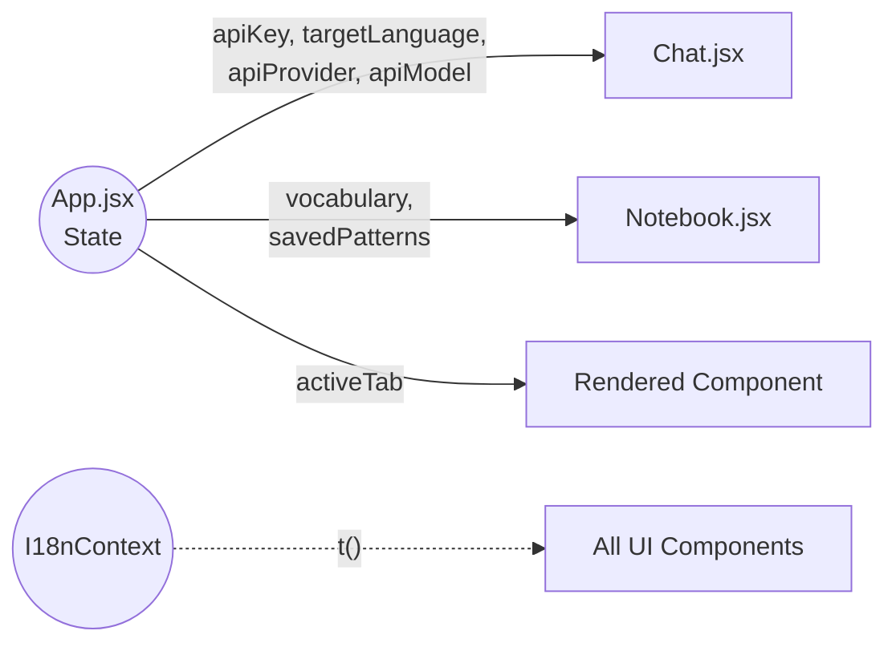

# Multi-Lang Coach 系統分析書 (SA Document)

本文件旨在提供 Multi-Lang Coach 專案的全面架構與邏輯解析，讓未來的開發團隊、維護人員，乃至於 AI Agent 都能依據此文件精準重建或擴充相同功能的系統。

> [!NOTE]
> ## 0. 系統分析書編撰規範 (SA Document Meta-Guidelines)
> *本前導說明專為未來的 AI 協作者設計，定義維護或擴充這份 `系統分析書.md` 時必須遵循的格式與風格。*
>
> ### [Tone & Formatting Style]
> - **Language**: 繁體中文為主，技術專有名詞保留英文原名（如 State, Component, Payload）。
> - **Tone**: 專業、簡潔、結構化，避免冗長無意義的敘述語氣。
> - **Modularity**: 若未來擴充的清單或原始碼過長，必須使用 `<details>` 與 `<summary>` HTML 標籤進行摺疊。
>
> ### [Structural Requirements]
> - **Visuals**: 必須使用 Mermaid (`mermaid` 區塊) 來繪製元件關聯圖與資料流拓樸，嚴禁僅使用純文字描述複雜架構。
> - **Schema Definitions**: 所有的資料模型（如 `localStorage`、API Request/Response 格式）一律使用 TypeScript `interface` 語法呈現，以確保 AI 解析時型別嚴謹。
> - **Alerts**: 對於專案中的特例、Bug Workaround 或絕對不可更改的限制，一律使用 GitHub Flavored Markdown Alerts (`[!CAUTION]`, `[!WARNING]`, `[!IMPORTANT]`) 標註。
>
> ### [AI Agent Directive Protocol]
> - 本文件第 8 章的「AI 代理重構指令碼」為**最高優先級的機器讀取區塊**。任何針對專案架構、狀態流或是防呆約束的修改，都**必須同步更新**該指令碼章節。

---

## 1. 專案概述 (Project Overview)

- **專案背景與目標**：Multi-Lang Coach 是一款由大型語言模型 (LLM) 驅動的互動式語言學習平台。解決傳統語言學習缺乏「真實情境演練」與「即時專業糾錯」的痛點。
- **目標受眾**：希望在職場 (如 IT、HR、行銷) 或日常生活情境中，精進英語或日語口說與對話流暢度、準確度的使用者。
- **核心功能亮點**：
  - 支援多 LLM 服務商 (Google Gemini API, Groq) 的高擬真情境對話。
  - 系統化課程 (Curriculum) 零基礎特訓功能。
  - 即時語音辨識 (支援跨平台 Web Speech API 與 Android 專屬處理機制)。
  - 即時文法糾錯與單字/片語萃取。
  - 多語系 (I18n) 介面與主題風格 (Theme) 切換功能。
  - 單字本 (Notebook) 與句型庫 (Pattern Notebook) 的個人化整理。

---

## 2. 系統架構與技術選型 (System Architecture & Tech Stack)

- **前端框架**：React 18 + Vite (純前端架構，無後端伺服器)。
- **路由機制**：無傳統 Router，透過 `App.jsx` 的 State (`activeTab`) 進行元件切換。
- **狀態管理**：React Hooks (`useState`, `useEffect`) 搭配 `localStorage` 進行狀態持久化，另透過 `I18nContext.jsx` 管理全域語系。
- **UI/UX 樣式**：Vanilla CSS (`App.css`, `index.css`)，全面採用 CSS Variables 實作深色主題、淺色主題與玻璃擬物化 (Glassmorphism) 設計切換。
- **第三方整合**：Google Gemini API、Groq API、Web Speech API、`html2pdf.js`。

### 視覺化系統架構
```mermaid
graph TD
    App[App.jsx<br>全域 State 容器] --> |提供翻譯函數 t()| I18nContext
    App --> |切換 Tab / 傳遞 Props| Sidebar
    App --> Dashboard[Dashboard.jsx<br>主控台]
    App --> Chat[Chat.jsx<br>核心對話引擎]
    App --> Curriculum[Curriculum.jsx<br>課程特訓]
    App --> Notebook[Notebook / Patterns<br>單字與句型庫]
    App --> Pages[AboutUs / PrivacyPolicy / ContactUs]
    
    Chat -.-> |Web Speech API / MediaRecorder| STT(語音辨識 STT)
    Chat -.-> |SpeechSynthesis| TTS(語音合成 TTS)
    Chat ==> |API 請求| LLM[llmClient.js<br>Gemini / Groq API]
    LLM ==> |回傳分析與對話| Chat
```

---

## 3. 功能模組與元件規劃 (Module Specifications)

專案組件集中於 `src/components`，主要劃分如下：

### 3.1 App.jsx (核心容器與全域狀態)
作為整個應用的 Entry Point，負責管理所有的全域狀態（API Key、Target Language、User Context、Theme、I18n 等），並作為 Props 傳遞給子元件。同時負責渲染 Settings (設定介面) 與 Welcome Modal，並於設定頁面顯示由 Vite 注入之版號 (`__APP_VERSION__`) 與建置日期 (`__BUILD_DATE__`)。

### 3.2 Chat.jsx (對話模組 - 系統核心)
處理與 LLM 的對話呈現、語音輸入邏輯、TTS 朗讀。支援多種對話情境：自由對話、情境任務、句型代換練習與課程特訓。
> [!NOTE]
> 支援「混合模式語音輸入」：電腦端預設使用原生 Web Speech API。Android 端則啟動特殊機制（詳見第 9 章邊界條件），改採音檔錄製轉 Base64 後交由 AI 或其他服務解析。

### 3.3 其他輔助模組
<details>
<summary>點擊展開模組詳情</summary>

- **Sidebar.jsx**：提供側邊導航列與介面風格切換。
- **Dashboard.jsx**：顯示學習進度，並從 `scenariosData.js` 動態讀取當日對話任務。
- **Curriculum.jsx**：系統化課程模組，引導使用者從零基礎學習單字與句型。
- **Notebook & PatternNotebook**：管理從對話中擷取的單字或使用者手動加入的句型。支援 TTS 朗讀。
- **Patterns.jsx**：展示靜態的基礎/進階句型，提供「句型代換練習 (Pattern Drill)」入口。
- **pages/**：包含 AboutUs, PrivacyPolicy, ContactUs 等靜態頁面。
- **Footer.jsx**：顯示版權聲明與靜態頁面連結。
</details>

---

## 4. 資料模型與狀態管理 (Data Models)

應用程式依賴 `localStorage` 來確保使用者關閉網頁後資料不遺失。我們使用 TypeScript Interface 來嚴謹定義核心資料模型：

### 4.1 Chat History Schema (對話紀錄模型)
```typescript
interface ChatMessage {
  role: 'system' | 'user' | 'assistant';
  content: string;               // 訊息內文
  translation?: string;          // 繁體/簡體中文翻譯
  correction?: {                 // 文法糾錯 (若無錯誤則為 null)
    original: string;
    error: string;
    fixed: string;
    explanation: string;
  };
  extractedVocab?: {             // 從對話中擷取的新單字
    term: string;
    phonetic: string;
    partOfSpeech: string;
    meaning: string;
    example: string;
  };
}
```

### 4.2 LocalStorage 鍵值映射 (Keys)
```typescript
interface LocalStorageKeys {
  APP_API_PROVIDER: string;           // 選擇的 API 提供者 (gemini / groq)
  APP_API_MODEL: string;              // 自訂模型名稱 (例如 llama-3.1-8b-instant)
  APP_GEMINI_API_KEY: string;         // API 憑證
  APP_USER_CAT: string;               // 使用者分類 (如: business)
  APP_USER_ROLE: string;              // 角色 (如: it)
  APP_USER_LEVEL: string;             // 程度 (如: pre-intermediate)
  IT_APP_TARGET_LANG: 'en' | 'ja';    // 學習目標語言
  IT_ENGLISH_APP_VOCABULARY: Array;   // 單字本資料
  IT_ENGLISH_APP_PATTERNS: Array;     // 儲存的句型資料
  APP_LEARNING_PROGRESS: Object;      // 連續登入與完成任務數
  APP_SPEECH_RATE: string;            // TTS 語速設定
  APP_AUTO_READ: string;              // 是否自動朗讀回覆
  APP_UI_THEME: string;               // 介面風格 (glass, saas-dark, saas-light)
  APP_ACTIVE_TAB: string;             // 當前處於的頁籤
}
```

---

## 5. AI 引擎與 Prompt Engineering

底層統一呼叫 `src/utils/llmClient.js`。目前系統支援切換服務商（如 Google Gemini 與 Groq Llama 模型）。

- **`callGeminiAPI` (情境對話)**：根據使用者的 Level 與 Scenario 給予角色設定。嚴格要求模型回傳符合 `ChatMessage` 介面的純 JSON 格式。支援傳遞 `apiProvider` 與 `apiModel` 參數。
- **`analyzeSentenceAPI` (句子深度解析)**：針對單一外語句子，回傳單字、句型與文法解析。
- **`polishSentenceAPI` (潤飾與翻譯)**：將使用者的破碎草稿，配合前文對話，翻譯成完美的外語。
- **`transcribeAudioWithGemini` (高精度語音辨識)**：若使用 Gemini，可傳入 Base64 音訊，指示模型「只回覆聽寫出的文字，絕對不要加上任何解釋」。

---

## 6. 靜態資料庫設計 (Static Data)

位於 `src/data`，作為無後端架構的資料支撐：
- **`categoryData.js`**：定義可選的 Categories、Roles 與 Levels。
- **`scenariosData.js`**：提供 `getScenariosByRole` 函數，依據角色動態生成情境任務 + 自由對話。
- **`curriculumData.js`**：定義課程系統的單元 (Unit)、核心單字與目標句型。
- **`patternsData.js` / `scenarioPatterns_*.json`**：預先整理好的海量句型庫資料。
- **`user_guide.md`**：靜態的新手教學與使用指南內容。

---

## 7. 未來擴展與維護指南 (Maintenance)

- **新增情境或角色**：修改 `categoryData.js` 新增 Role ID，並於 `scenariosData.js` 加入情境邏輯。
- **新增課程內容**：在 `curriculumData.js` 中依照現有結構擴增新的 Unit 內容，並確保對應目標語言 (`en` / `ja`) 的欄位存在。
- **多語系 (I18n) 擴展**：修改 `src/contexts/I18nContext.jsx` 中 `translations` 物件，添加所需的翻譯對照表。
- **替換底層 LLM**：可於 `llmClient.js` 擴充 `fetch` 邏輯，並於 `App.jsx` 的設定介面增加 `apiProvider` 選項。

---

## 8. AI 代理重構指令碼 (AI Agent Reconstruction Directive)

*This section is strictly formatted for LLM/AI Agent parsing. Do NOT modify unless updating core architecture constraints.*

### [Repository Skeleton]
```text
/src
 ├─ App.jsx (Global State Hub)
 ├─ main.jsx (React Root)
 ├─ App.css & index.css (CSS variables & multi-theme classes)
 ├─ /components (Chat, Dashboard, Curriculum, Notebook, PatternNotebook, Patterns, Guide, Sidebar, Footer)
 │   └─ /pages (AboutUs, PrivacyPolicy, ContactUs)
 ├─ /utils (llmClient.js, pdfExporter.js)
 ├─ /data (categoryData.js, scenariosData.js, curriculumData.js, patternsData.js, ...)
 └─ /contexts (I18nContext.jsx)
```

### [State Flow Topology]

All states in `App.jsx` MUST have an equivalent `useEffect` that serializes and saves to `localStorage` on change.

### [Core Logic Constraints (CRITICAL)]

> [!CAUTION]
> **1. LLM JSON Fallback (CRITICAL)**: Inside `llmClient.js`, when parsing LLM responses for JSON, you MUST implement a fallback regex to strip ` ```json ` and ` ``` ` tags. LLMs frequently wrap JSON in markdown blocks despite explicit system instructions.

> [!WARNING]
> **2. Android STT Bug Workaround**: Android Chrome Web Speech API duplicates text continuously. Inside `Chat.jsx` `toggleRecording`, you MUST check if `androidSmartSpeech` is enabled. If true, bypass native SpeechRecognition and utilize alternative MediaRecorder logic for STT.

> [!IMPORTANT]
> **3. TTS Multi-Lang Segmentation**: In `Chat.jsx` `handleSpeak`, English sentences containing Chinese translations MUST be split by regex (CJK characters) into separate `SpeechSynthesisUtterance` instances. Do not rely on the browser to auto-switch languages mid-sentence.

> [!IMPORTANT]
> **4. Multi-Provider Fetch Consistency**: ALL API fetch calls in `llmClient.js` must route correctly based on `apiProvider` (e.g., `gemini` vs `groq`) and construct payload URLs accordingly (e.g., Groq OpenAI-compatible endpoints vs Gemini v1beta endpoints).

### [Sequential Build Steps]
1. **Init**: Create Vite React app. Build `index.css` with CSS variables supporting `data-theme`. Modify `vite.config.js` to define global variables `__APP_VERSION__` and `__BUILD_DATE__`.
2. **Context & Data**: Build `I18nContext.jsx` for global translations. Define `src/data` static structures including curriculum and scenarios.
3. **Core Utils**: Build `llmClient.js` supporting both Gemini and Groq with strictly formatted API payloads.
4. **UI Components**: Build purely functional side components (`Sidebar`, `Dashboard`, `Curriculum`, `Pages`).
5. **Chat Engine**: Build `Chat.jsx`. Implement STT MediaRecorder fallback, TTS segmentation, and LLM handlers.
6. **Assembly**: Wire everything into `App.jsx` with full `localStorage` syncing and Theme toggling.


